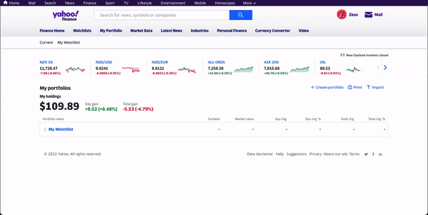
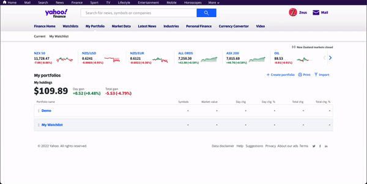

# Automated Transaction Data-Entry

This is a simple Java project built using the [Selenium]() testing framework. It starts off by downloading a transaction `csv` file from the investing brokerage platform [Sharesies]() and then enters that collected data into your own [Yahoo Portfolio](https://finance.yahoo.com/portfolios/). The project is built using the Page Object Model desgin pattern, for greater maintaince, extensions and testing.

<p align='center'> </br>

</p>

## How to Run

### Step 1
Create Accounts for both [Yahoo Finance]() and [Sharesies]() and have transaction data present in Sheresies i.e. you have participated in the action of buying and/or selling stocks or funds.

### Step 2
In your Yahoo Accout *create a Portfolio* with the name of your choosing (or `Current` which is the default name of the Portfolio the program will enter data into). 

<p align='center'>

</p>

### Step 3
Add the stocks you currently hold or want data to be entered in for into the Portfolio.

<p align='center'>

</p>

### Step 4
Clone/Download the project repo into your local machine. 
``` bash
git clone https://github.com/modothprav/Automated-Portfolio-Tracking.git
```

### Step 5
Download a version of [Chromedriver]() that is compatiable with your current [Chrome]() browser version. After installing, save it inside the project root folder.
``` bash
cd Automated-Portfolio-Tracking
cp ~/Downloads/chromedriver chromedriver
```

### Step 6 
Copy the Sample credentials file in the same location as the project and update it with **your account** credentials.
``` bash
cd Automated-Portfolio-Tracking/src/assets
cp credentials.sample.properties credentials.properties
nano credentials.properties
```

### Step 7 - Optional
If you had named your Portfolio in Yahoo Finance different to the defualt name (Current) then head over to the config file located at `src/main/java/config/config.properties` and update the config value of `yahoo.portfolio.name` with the name of your own portfolio.

### Step 8
Install dependencies by building the project with Maven and finally compile and run.
``` bash
mvn compile
mvn exec:java -Dexec.mainClass=automate.Automation -Dexec.cleanupDaemonThreads=false -Dexec.args="[fromMonth] [fromYear] [toMonth] [toYear]" -e
```
e.g.
```
mvn exec:java -Dexec.mainClass=automate.Automation -Dexec.cleanupDaemonThreads=false -Dexec.args="August 2000 June 2005" -e
```

---

## About

I reguraly invest small amounts into stocks/funds through Sharesies and used to manually enter in the transaction data for each of my orders into Yahoo Finance. I did this to gain a better understanding of how well each of my holdings were doing overtime, since Yahoo Fiance provides more analycits and performance metrics for various stocks. 

At the time I was also on a hunt for a personal project to work on and thought I should work on building something that will automate this duanting process. Hence began the journey of figuring out how to automate my manual data entry process and what tools and technologies to use to get the job done.
